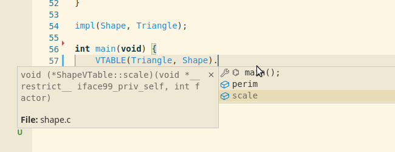

# Interface99
[](https://github.com/Hirrolot/interface99/actions)
[](https://lists.sr.ht/~hirrolot/metalang99)

Type-safe zero-boilerplate interfaces for pure C99, implemented as a single-header library.

[ [`examples/state.c`](examples/state.c) ]
```c
#include <interface99.h>

#include <stdio.h>

#define State_INTERFACE               \
    iFn(int, get, void *self);        \
    iFn(void, set, void *self, int x);

interface(State);

typedef struct {
    int x;
} Num;

int Num_State_get(void *self) {
    return ((Num *)self)->x;
}

void Num_State_set(void *self, int x) {
    ((Num *)self)->x = x;
}

impl(State, Num);

void test(State st) {
    printf("x = %d\n", st.vptr->get(st.self));
    st.vptr->set(st.self, 5);
    printf("x = %d\n", st.vptr->get(st.self));
}

int main(void) {
    Num n = {0};
    State st = DYN(Num, State, &n);
    test(st);
}
```

<details>
  <summary>Output</summary>

```
x = 0
x = 5
```

</details>

## Highlights

 - **Zero-boilerplate.** Forget about constructing virtual tables manually -- Interface99 will do it for you!

 - **Portable.** Everything you need is a standard-conforming C99 compiler; neither the standard library, nor compiler/platform-specific functionality or VLA are required.

 - **Predictable.** Interface99 comes with formal [code generation semantics], meaning that the generated data layout is guaranteed to always be the same.

 - **Comprehensible errors.** Despite that Interface99 is built upon macros, compilation errors are usually [comprehensible](#q-what-about-compile-time-errors).

[code generation semantics]: #semantics

## Features

| Feature | Status | Description |
|---------|--------|-------------|
| [Multiple interface inheritance](examples/read_write.c) | ✅ | A type can inherit multiple interfaces at the same time. |
| [Superinterfaces](examples/airplane.c) | ✅ | One interface can require a set of other interfaces to be implemented as well. |
| [Marker interfaces](examples/marker.c) | ✅ | An interface with no functions. |
| [Single/Dynamic dispatch](examples/state.c) | ✅ | Determine a function to be called at runtime based on `self`. |
| Multiple dispatch | ❌ | Determine a function to be called at runtime based on multiple arguments. Likely to never going to be implemented. |
| [Dynamic objects of multiple interfaces](examples/read_write_both.c)  | ✅ | Given interfaces `Foo` and `Bar`, you can pass an object of both interfaces to a function, `FooBar obj`. |
| Default functions | ❌ | Some interface functions may be given default implementations. |

## Installation

 1. Download Interface99 and [Metalang99] (minimum supported version -- [1.5.0](https://github.com/Hirrolot/metalang99/releases/tag/v1.5.0)).
 2. Add `interface99` and `metalang99/include` to your include paths.
 3. `#include <interface99.h>` beforehand.

Some handy advices:

 - **PLEASE**, use Interface99 only with [`-ftrack-macro-expansion=0`] (GCC), [`-fmacro-backtrace-limit=1`] (Clang), or something similar, otherwise it will throw your compiler to the moon.

 - [Precompile headers] that use Interface99 so that they will not be compiled each time they are included. It is helpful to reduce compilation times, but they are not mandatory.

[Metalang99]: https://github.com/Hirrolot/metalang99
[Precompile headers]: https://en.wikipedia.org/wiki/Precompiled_header
[`-ftrack-macro-expansion=0`]: https://gcc.gnu.org/onlinedocs/gcc/Preprocessor-Options.html
[`-fmacro-backtrace-limit=1`]: https://clang.llvm.org/docs/ClangCommandLineReference.html#cmdoption-clang-fmacro-backtrace-limit

## Usage

If you have experience with other general-purpose PLs, you should already know how to use Interface99. Go and look through the [examples](examples/) to see how it performs in the wild.

In this section we are to clarify some details that are specific to Interface99. First of all, these are three major concepts:

 1. **Interface definition:**
    - [`interface(Vehicle);`](#interface)
 2. **Implementation declaration:**
    - Internal linkage: [`declImpl(Vehicle, Car);`](#declImpl)
    - External linkage: [`externDeclImpl(Vehicle, Car);`](#externDeclImpl)
 3. **Implementation definition:**
    - Internal linkage:
      - Ordinary implementation: [`impl(Vehicle, Car);`](#impl)
      - Primary implementation: [`implPrimary(Vehicle, Car);`](#implPrimary)
    - External linkage:
      - Ordinary implementation: [`externImpl(Vehicle, Car);`](#externImpl)
      - Primary implementation: [`externImplPrimary(Vehicle, Car);`](#externImplPrimary)

Notes:
 - The terms "declaration" & "definition" have the same semantics as in the C programming language. In particular:
   - An interface implementation definition is also a declaration.
   - If you want to share an interface implementation across TUs, you must put its declaration into `*.h` and its definition into `*.c`
 - A primary implementation means that instead of naming functions like `Car_Vehicle_drive`, you write just `Car_drive` (more on this later).

What do the macros generate? [`interface`](#interface) generates a virtual table and a so-called _dynamic interface object_ type. In the case of [`examples/state.c`](examples/state.c):

```c
typedef struct StateVTable {
    int (*get)(void *self);
    void (*set)(void *self, int x);
} StateVTable;

typedef struct State {
    void *self;
    const StateVTable *vptr;
} State;
```

`impl` generates a constant variable of type `StateVTable`:

```c
static const StateVTable Num_State_impl = {
    .get = Num_State_get,
    .set = Num_State_set,
};
```

Notes:
 - If you were using [`externImpl`](#externImpl), this definition would be `extern` as well.
 - If you were using [`implPrimary`](#implPrimary)/[`externImplPrimary`](#externImplPrimary), you would have to define the functions as `Num_get` & `Num_set` instead of `Num_State_get` & `Num_State_set`.

This is the implementation of `State` for `Num`. Normally you will not use it directly but through `State.vptr`. `State`, in its turn, is instantiated by [`DYN`](#DYN):

```с
Num n = {0};
State st = DYN(Num, State, &n);
```

Since `State` is polymorphic over its implementations, you can accept it as a function parameter and manipulate it through `.self` & `.vptr`:

```c
void test(State st) {
    printf("x = %d\n", st.vptr->get(st.self));
    st.vptr->set(st.self, 5);
    printf("x = %d\n", st.vptr->get(st.self));
}
```

The last thing unmentioned is superinterfaces, or interface requirements. [`examples/airplane.c`](examples/airplane.c) demonstrates how to extend interfaces with new functionality:

```c
#define Vehicle_INTERFACE                              \
    iFn(void, move_forward, void *self, int distance); \
    iFn(void, move_back, void *self, int distance);

interface(Vehicle);

#define Airplane_INTERFACE                             \
    iFn(void, move_up, void *self, int distance);      \
    iFn(void, move_down, void *self, int distance);

#define Airplane_EXTENDS (Vehicle)

interface(Airplane);
```

(Note that `#define Airplane_EXTENDS` must appear prior to `interface(Airplane);`.)

Here, `Airplane` extends `Vehicle` with the new functions `move_up` and `move_down`. Everywhere you have `Airplane`, you also have a pointer to `VehicleVTable` accessible as `Airplane.vptr->Vehicle`:

```c
Airplane my_airplane = DYN(MyAirplane, Airplane, &(MyAirplane){0, 0});

my_airplane.vptr->Vehicle->move_forward(my_airplane.self, 10);
my_airplane.vptr->Vehicle->move_back(my_airplane.self, 3);
```

Thus, Interface99 embeds superinterfaces into subinterfaces's virtual tables, thereby forming a _virtual table hierarchy_. Of course, you can specify an arbitrary amount of interfaces along with `(Vehicle)`, like `Repairable` or `Armoured`, and they all will be included in `AirplaneVTable` like so:

```c
typedef struct AirplaneVTable {
    void (*move_up)(void *self, int distance);
    void (*move_down)(void *self, int distance);
    const VehicleVTable *Vehicle;
    const RepairableVTable *Repairable;
    const ArmouredVTable *Armoured;
} AirplaneVTable;
```

Happy hacking!

## Syntax and semantics

Having a well-defined semantics of the macros, you can write an FFI which is quite common in C.

### EBNF syntax

```ebnf
<iface-def>         ::= "interface(" <iface> ")" ;

<fn>                ::= "iFn(" <fn-ret-ty> "," <fn-name> "," <fn-params> ");" ;
<fn-ret-ty>         ::= <type> ;
<fn-name>           ::= <ident> ;
<fn-params>         ::= <parameter-type-list> ;

<impl>              ::= "impl("        <iface> "," <implementor> ")" ;
<implPrimary>       ::= "implPrimary(" <iface> "," <implementor> ")" ;
<declImpl>          ::= "declImpl("    <iface> "," <implementor> ")" ;

<externImpl>        ::= "impl("        <iface> "," <implementor> ")" ;
<externImplPrimary> ::= "implPrimary(" <iface> "," <implementor> ")" ;
<externDeclImpl>    ::= "declImpl("    <iface> "," <implementor> ")" ;

<dyn>               ::= "DYN("    <implementor> "," <iface> "," <ptr> ")" ;
<vtable>            ::= "VTABLE(" <implementor> "," <iface> ")" ;

<iface>             ::= <ident> ;
<implementor>       ::= <ident> ;
<requirement>       ::= <iface> ;
```

Notes:

 - `<iface>` refers to a user-defined macro `<iface>_INTERFACE` which must expand to `{ <fn> }*`. It must be defined for every interface.
 - For any interface, a macro `<iface>_EXTENDS` can be defined. It must expand to `"(" <requirement> { "," <requirement> }* ")"`.

### Semantics

(It might be helpful to look at the [generated data layout](https://godbolt.org/z/Mn98f359z) of [`examples/state.c`](examples/state.c).)


#### `interface`

Expands to

```
typedef struct <iface>VTable <iface>VTable;
typedef struct <iface> <iface>;

struct <iface>VTable {
    // Only if <iface> is a marker interface without superinterfaces:
    char dummy;

    <fn-ret-ty>0 (*<fn-name>0)(<fn-params>0);
    ...
    <fn-ret-ty>N (*<fn-name>N)(<fn-params>N);

    const <requirement>0VTable *<requirement>;
    ...
    const <requirement>NVTable *<requirement>;
};

struct <iface> {
    void *self;
    const <iface>VTable *vptr;
}
```

(`char dummy;` is needed for an empty `<iface>VTable` because a structure must have at least one member, according to C99.)

I.e., this macro defines a virtual table structure for `<iface>`, as well as the structure `<iface>` polymorphic over `<iface>` implementors. This is generated in two steps:

 - **Function pointers**. For each `<fn-name>I` specified in the macro `<iface>_INTERFACE`, the corresponding function pointer is generated.
 - **Requirements obligation.** If the macro `<iface>_EXTENDS` is defined, then the listed requirements are generated to obligate `<iface>` implementors to satisfy them.

#### `impl`

Expands to

```
static const <iface>VTable VTABLE(<implementor>, <iface>) = {
    // Only if <iface> is a marker interface without superinterfaces:
    .dummy = '\0',

    <fn_name>0 = <implementor>_<iface>_<fn-name>0,
    ...
    <fn-name>N = <implementor>_<iface>_<fn-name>N,

    <requirement>0 = &VTABLE(<implementor, <requirement>0),
    ...
    <requirement>N = &VTABLE(<implementor, <requirement>N),
}
```

I.e., this macro defines a virtual table instance of type `<iface>VTable` for `<implementor>`. It is generated in two steps:

 - **Function implementations.** Each `<implementor>_<iface>_<fn-name>I` refers to a function belonging to `<implementor>` which implements the corresponding function of `<iface>`.
 - **Requirements satisfaction.** If the macro `<iface>_EXTENDS` is defined, then the listed requirements are generated to satisfy `<iface>`.

#### `implPrimary`

Like [`impl`](#impl) but captures the `<implementor>_<fn-name>` functions instead of `<implementor>_<iface>_<fn-name>`.

#### `declImpl`

Expands to `static const <iface>VTable VTABLE(<implementor>, <iface>)`, i.e., it declares a virtual table instance of `<implementor>` of type `<iface>VTable`.

#### `externImpl`

The same as [`impl`](#impl) but generates an `extern` definition instead of `static`.

#### `externImplPrimary`

The same as [`implPrimary`](#implPrimary) but generates an `extern` definition instead of `static`.

#### `externDeclImpl`

The same as [`declImpl`](#declImpl) but generates an `extern` declaration instead of `static`.

#### `DYN`

Expands to an expression of type `<iface>`, with `.self` initialised to `<ptr>` and `.vptr` initialised to `&VTABLE(<implementor>, <iface>)`.

#### `VTABLE`

Expands to `<implementor>_<iface>_impl`, i.e., a virtual table instance of `<implementor>` of type `<iface>VTable`.

## Miscellaneous

 - The macros `IFACE99_MAJOR`, `IFACE99_MINOR`, and `IFACE99_PATCH` stand for the corresponding components of a version of Interface99.

 -  If you do **not** want the shortened versions to appear (e.g., `interface` without the prefix `99`), define `IFACE99_NO_ALIASES` prior to `#include <interface99.h>`.

 - For each macro using `ML99_EVAL`, Interface99 provides its [Metalang99-compliant](https://metalang99.readthedocs.io/en/latest/#definitions) counterpart which can be used inside derivers and other Metalang99-compliant macros:

| Macro | Metalang99-compliant counterpart |
|----------|----------|
| `interface` | `IFACE99_interface` |
| `impl` | `IFACE99_impl` |
| `implPrimary` | `IFACE99_implPrimary` |
| `externImpl` | `IFACE99_externImpl` |
| `externImplPrimary` | `IFACE99_externImplPrimary` |

(An [arity specifier] and [desugaring macro] are provided for each of the above macros.)

[arity specifier]: https://hirrolot.gitbook.io/metalang99/partial-application
[desugaring macro]: https://metalang99.readthedocs.io/en/latest/#definitions

## Guidelines

 - Prepend `impl`s with `static` if they must appear only in a single TU: `static impl(...);`.
 - Use `implPrimary` to avoid boilerplate if you implement an interface considered primary for some concrete type (see [`examples/media_stream.c`](examples/media_stream.c)).

## Pitfalls

No pitfalls discovered yet.

## Credits

Thanks to Rust and Golang for their implementations of traits/interfaces.

## Publications

 - [_What’s the Point of the C Preprocessor, Actually?_](https://hirrolot.github.io/posts/whats-the-point-of-the-c-preprocessor-actually.html) by Hirrolot.
 - [_Macros on Steroids, Or: How Can Pure C Benefit From Metaprogramming_](https://hirrolot.github.io/posts/macros-on-steroids-or-how-can-pure-c-benefit-from-metaprogramming.html) by Hirrolot.
 - [_Extend Your Language, Don’t Alter It_](https://hirrolot.github.io/posts/extend-your-language-dont-alter-it.html) by Hirrolot.

## FAQ

### Q: Why use C instead of Rust/Zig/whatever else?

A: See [Datatype99's README >>](https://github.com/Hirrolot/datatype99#q-why-use-c-instead-of-rustzigwhatever-else).

### Q: Why not third-party code generators?

A: See [Metalang99's README >>](https://github.com/Hirrolot/metalang99#q-why-not-third-party-code-generators).

### Q: How does it work?

A: Interface99 is implemented upon [Metalang99], a preprocessor metaprogramming library.

### Q: Does it work on C++?

A: Yes, C++11 and onwards is supported.

### Q: How Interface99 differs from similar projects?

A:

 - **Less boilerplate.** In particular, Interface99 deduces function implementations from the context, thus improving code maintenance. To my knowledge, no other alternative can do this.

 - **Small.** Interface99 only features the software interface concept, no less and no more -- it does not bring all the other fancy OOP stuff, unlike [GObject] or [COS].

 - **Depends on Metalang99.** Interface99 is built upon [Metalang99], the underlying metaprogramming framework. With Metalang99, you can also use [Datatype99].

Other worth-mentioning projects:

 - [typeclass-interface-pattern], though it is rather a general idea than a ready-to-use implementation.
 - [OOC] -- a book about OO programming in ANSI C.

[`obj.h`]: https://github.com/small-c/obj.h
[GObject]: https://developer.gnome.org/gobject/stable/
[COS]: http://ldeniau.web.cern.ch/ldeniau/cos.html
[Datatype99]: https://github.com/Hirrolot/datatype99
[typeclass-interface-pattern]: https://github.com/TotallyNotChase/typeclass-interface-pattern
[OOC]: https://www.cs.rit.edu/~ats/books/ooc.pdf

### Q: What about compile-time errors?

----------

#### Error: missing interface implementation

[`playground.c`]
```c
#define Foo_INTERFACE iFn(void, foo, int x, int y);
interface(Foo);

typedef struct {
    char dummy;
} MyFoo;

// Missing `void MyFoo_Foo_foo(int x, int y)`.

impl(Foo, MyFoo);
```

[`/bin/sh`]
```
playground.c:12:1: error: ‘MyFoo_Foo_foo’ undeclared here (not in a function); did you mean ‘MyFoo_Foo_impl’?
   12 | impl(Foo, MyFoo);
      | ^~~~
      | MyFoo_Foo_impl
```

----------

#### Error: improperly typed interface implementation

[`playground.c`]
```c
#define Foo_INTERFACE iFn(void, foo, int x, int y);
interface(Foo);

typedef struct {
    char dummy;
} MyFoo;

void MyFoo_Foo_foo(const char *str) {}

impl(Foo, MyFoo);
```

[`/bin/sh`]
```
playground.c:12:1: warning: initialization of ‘void (*)(int,  int)’ from incompatible pointer type ‘void (*)(const char *)’ [-Wincompatible-pointer-types]
   12 | impl(Foo, MyFoo);
      | ^~~~
```

----------

#### Error: unsatisfied interface requirement

[`playground.c`]
```c
#define Foo_INTERFACE iFn(void, foo, int x, int y);
interface(Foo);

#define Bar_INTERFACE iFn(void, bar, void);
#define Bar_EXTENDS   (Foo)

interface(Bar);

typedef struct {
    char dummy;
} MyBar;

void MyBar_Bar_bar(void) {}

// Missing `impl(Foo, MyBar)`.

impl(Bar, MyBar);
```

[`/bin/sh`]
```
playground.c:17:1: error: ‘MyBar_Foo_impl’ undeclared here (not in a function); did you mean ‘MyBar_Bar_impl’?
   17 | impl(Bar, MyBar);
      | ^~~~
      | MyBar_Bar_impl
playground.c:17:1: warning: missing initializer for field ‘Foo’ of ‘BarVTable’ [-Wmissing-field-initializers]
playground.c:9:1: note: ‘Foo’ declared here
    9 | interface(Bar);
      | ^~~~~~~~~
```

----------

#### Error: typo in `DYN`

[`playground.c`]
```c
#define Foo_INTERFACE iFn(void, foo, void);
interface(Foo);

typedef struct {
    char dummy;
} MyFoo;

void MyFoo_Foo_foo(void) {}

impl(Foo, MyFoo);

int main(void) {
    Foo foo = DYN(Foo, /* MyFoo */ MyBar, &(MyFoo){0});
}
```

[`/bin/sh`]
```
playground.c: In function ‘main’:
playground.c:15:15: error: ‘MyBar’ undeclared (first use in this function)
   15 |     Foo foo = DYN(Foo, /* MyFoo */ MyBar, &(MyFoo){0});
      |               ^~~
playground.c:15:15: note: each undeclared identifier is reported only once for each function it appears in
playground.c:15:18: error: expected ‘)’ before ‘{’ token
   15 |     Foo foo = DYN(Foo, /* MyFoo */ MyBar, &(MyFoo){0});
      |               ~~~^
      |                  )
```

----------

#### Error: typo in `VTABLE`

[`playground.c`]
```c
#define Foo_INTERFACE iFn(void, foo, void);
interface(Foo);

typedef struct {
    char dummy;
} MyFoo;

void MyFoo_Foo_foo(void) {}

impl(Foo, MyFoo);

int main(void) {
    FooVTable foo = VTABLE(/* MyFoo */ MyBar, Foo);
}
```

[`/bin/sh`]
```
playground.c: In function ‘main’:
playground.c:15:21: error: ‘MyBar_Foo_impl’ undeclared (first use in this function); did you mean ‘MyFoo_Foo_impl’?
   15 |     FooVTable foo = VTABLE(/* MyFoo */ MyBar, Foo);
      |                     ^~~~~~
      |                     MyFoo_Foo_impl
```

----------

From my experience, nearly 95% of errors make sense.

If an error is not comprehensible at all, try to look at generated code (`-E`). Hopefully, the [code generation semantics] is formally defined so normally you will not see something unexpected.

### Q: What about IDE support?



A: VS Code automatically enables suggestions of generated types but, of course, it does not support macro syntax highlightment.

### Q: Why use `void *self` instead of `T *self` in implementations?

A: This trick technically [results in UB](https://stackoverflow.com/questions/559581/casting-a-function-pointer-to-another-type); Interface99 is agnostic to function parameters (including `self`) though as it claims strict C99 conformance, all the examples are using `void *self`.

### Q: What compilers are tested?

A: Interface99 is known to work on these compilers:

 - GCC
 - Clang
 - MSVC
 - TCC
