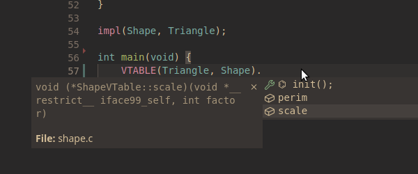

# Interface99
[](https://github.com/Hirrolot/interface99/actions)
[](https://lists.sr.ht/~hirrolot/metalang99)

Type-safe zero-boilerplate interfaces for pure C99, implemented as a single-header library.

[ [`examples/shape.c`](examples/shape.c) ]
```c
#include <interface99.h>

#include <stdio.h>

#define Shape_IFACE                      \
    vfunc( int, perim, const VSelf)      \
    vfunc(void, scale, VSelf, int factor)

interface(Shape);

// Rect implementation
// ============================================================

typedef struct {
    int a, b;
} Rect;

int Rect_perim(const VSelf) {
    VSELF(const Rect);
    return (self->a + self->b) * 2;
}

void Rect_scale(VSelf, int factor) {
    VSELF(Rect);
    self->a *= factor;
    self->b *= factor;
}

impl(Shape, Rect);

// Triangle implementation
// ============================================================

typedef struct {
    int a, b, c;
} Triangle;

int Triangle_perim(const VSelf) {
    VSELF(const Triangle);
    return self->a + self->b + self->c;
}

void Triangle_scale(VSelf, int factor) {
    VSELF(Triangle);
    self->a *= factor;
    self->b *= factor;
    self->c *= factor;
}

impl(Shape, Triangle);

// Test
// ============================================================

void test(Shape shape) {
    printf("perim = %d\n", VCALL(shape, perim));
    VCALL(shape, scale, 5);
    printf("perim = %d\n", VCALL(shape, perim));
}

int main(void) {
    Shape rect = DYN(Rect, Shape, &(Rect){5, 7}),
          triangle = DYN(Triangle, Shape, &(Triangle){1, 2, 3});

    test(rect);
    test(triangle);
}
```

<details>
  <summary>Output</summary>

```
perim = 24
perim = 120
perim = 6
perim = 30
```

</details>

The design of Interface99 is pretty similar to that of high-level programming languages; at the same time, it feels like you still program in plain C. Just functions and data structures, nothing more.

## Highlights

 - **Zero-boilerplate.** Forget about constructing virtual tables manually -- Interface99 will do it for you!

 - **Portable.** Everything you need is a standard-conforming C99 compiler; neither the standard library, nor compiler/platform-specific functionality or VLA are required.

 - **Predictable.** Interface99 comes with formal [code generation semantics], meaning that the generated data layout is guaranteed to always be the same.

 - **Comprehensible errors.** Interface99 is [resilient to bad code].

[code generation semantics]: #semantics
[resilient to bad code]: #q-what-about-compile-time-errors

## Features

| Feature | Status | Description |
|---------|--------|-------------|
| [Multiple interface inheritance](examples/read_write.c) | ✅ | A type can inherit multiple interfaces at the same time. |
| [Superinterfaces](examples/airplane.c) | ✅ | One interface can require a set of other interfaces to be implemented as well. |
| [Marker interfaces](examples/marker.c) | ✅ | An interface with no functions. |
| [Single/Dynamic dispatch](examples/shape.c) | ✅ | Determine a function to be called at runtime based on `self`. |
| Multiple dispatch | ❌ | Determine a function to be called at runtime based on multiple arguments. Likely to never going to be implemented. |
| [Dynamic objects of multiple interfaces](examples/read_write_both.c)  | ✅ | Given interfaces `Foo` and `Bar`, you can construct an object of both interfaces, `FooBar obj`. |
| [Default implementations](examples/default_impl.c)  | ✅ | Some interface functions may be given default implementations. A default function can call other functions and vice versa. |
| Data and implementation separation  | ✅ | New interfaces can be implemented for existing types. |

## Installation

 1. Download Interface99 and [Metalang99] (minimum supported version -- [1.10.0](https://github.com/Hirrolot/metalang99/releases/tag/v1.10.0)).
 2. Add `interface99` and `metalang99/include` to your include paths.
 3. `#include <interface99.h>` beforehand.

Some handy advices:

 - **PLEASE**, use Interface99 only with [`-ftrack-macro-expansion=0`] (GCC), [`-fmacro-backtrace-limit=1`] (Clang), or something similar, otherwise it will throw your compiler to the moon.

 - [Precompile headers] that use Interface99 so that they will not be compiled each time they are included. It is helpful to reduce compilation times, but they are not mandatory.

[Metalang99]: https://github.com/Hirrolot/metalang99
[Precompile headers]: https://en.wikipedia.org/wiki/Precompiled_header
[`-ftrack-macro-expansion=0`]: https://gcc.gnu.org/onlinedocs/gcc/Preprocessor-Options.html
[`-fmacro-backtrace-limit=1`]: https://clang.llvm.org/docs/ClangCommandLineReference.html#cmdoption-clang-fmacro-backtrace-limit

## Tutorial

This section is based on a collection of well-documented [examples](examples/), each of which demonstrates one specific aspect of Interface99.

### Basic usage

 1. **Interface definition.**

Syntax: [`interface(Shape);`](#interface)

An interface definition expands to a virtual table structure and a so-called _interface object type_. In the case of [`examples/shape.c`](examples/shape.c):

```c
// interface(Shape);
typedef struct ShapeVTable ShapeVTable;
typedef struct Shape Shape;

struct ShapeVTable {
    int (*perim)(const VSelf);
    void (*scale)(VSelf, int factor);
};

struct Shape {
    void *self;
    const ShapeVTable *vptr;
};
```

Here, `Shape.self` is the pointer to an object whose type implements `Shape`, and `Shape.vptr` points to a corresponding virtual table instance. Inside `ShapeVTable`, you can observe the mysterious [`VSelf`](#vcall_) bits -- they expand to parameters of type `void * restrict`; when calling these methods, Interface99 will substitute `Shape.self` for these parameters.

Usually, interface definitions go in `*.h` files.

 2. **Implementation definition.**

| Linkage | Syntax |
|---------|--------|
| Internal | [`impl(Shape, Rect);`](#impl) |
| External | [`externImpl(Shape, Rect);`](#externImpl) |

An implementation definition expands to nothing but a virtual table instance of a particular implementer. In the case of `examples/shape.c`:

```c
// impl(Shape, Rect);
static const ShapeVTable VTABLE(Rect, Shape) = {
    .perim = Rect_perim,
    .scale = Rect_scale,
};
```

(If you were using [`externImpl`](#externImpl), this definition would be `extern` likewise.)

Note that inside function implementations, we use [`VSELF`](#vselfvself), which simply casts the parameter introduced by `VSelf` to a user-defined type (`const Rect` or `Rect` in our case):

```c
int Rect_perim(const VSelf) {
    VSELF(const Rect);
    return (self->a + self->b) * 2;
}

void Rect_scale(VSelf, int factor) {
    VSELF(Rect);
    self->a *= factor;
    self->b *= factor;
}
```

 3. **Dynamic dispatch.**

Once an interface and its implementations are both generated, it is time to instantiate an interface object and invoke some functions upon it.

First of all, to instantiate `Shape`, use the [`DYN`](#DYN) macro:

```с
Shape rect = DYN(Rect, Shape, &(Rect){5, 7})
test(rect);
```

Here, `DYN(Rect, Shape, &(Rect){5, 7})` creates `Shape` by assigning `Shape.self` to `&(Rect){5, 7}` and `Shape.vptr` to the aforementioned `Rect_Shape_impl`. Eventually, since `Shape` is polymorphic over its implementations (which is the essence of dynamic dispatch), you can accept `rect` as a function parameter and invoke some methods on it:

```c
void test(Shape shape) {
    printf("perim = %d\n", VCALL(shape, perim));
    VCALL(shape, scale, 5);
    printf("perim = %d\n", VCALL(shape, perim));
}
```

Besides [`VCALL`](#vcall_), you also have `VCALL_OBJ`, `VCALL_SUPER`, and `VCALL_SUPER_OBJ`; for more information, please refer to their documentation. Also, remember that your virtual function can accept literally any parameters, even without `self`, so you can invoke them as `obj.vptr->foo(...)` as well.

Congratulations, this is all you need to know to write most of the stuff!

### Superinterfaces

Interface99 has the feature called superinterfaces, or interface requirements. [`examples/airplane.c`](examples/airplane.c) demonstrates how to extend interfaces with new functionality:

```c
#define Vehicle_IFACE                              \
    vfunc(void, move_forward, VSelf, int distance) \
    vfunc(void,    move_back, VSelf, int distance)

interface(Vehicle);

#define Airplane_IFACE                          \
    vfunc(void,   move_up, VSelf, int distance) \
    vfunc(void, move_down, VSelf, int distance)

#define Airplane_EXTENDS (Vehicle)

interface(Airplane);
```

(Note that `#define Airplane_EXTENDS` must appear prior to `interface(Airplane);`.)

Here, `Airplane` extends `Vehicle` with the new functions `move_up` and `move_down`. Everywhere you have `Airplane`, you also have a pointer to `VehicleVTable` accessible as `Airplane.vptr->Vehicle`:

```c
Airplane my_airplane = DYN(MyAirplane, Airplane, &(MyAirplane){0, 0});

VCALL_SUPER(my_airplane, Vehicle, move_forward, 10);
VCALL_SUPER(my_airplane, Vehicle, move_back, 3);
```

Thus, Interface99 embeds superinterfaces' virtual tables into those of subinterfaces, thereby forming a _virtual table hierarchy_. Of course, you can specify an arbitrary amount of interfaces along with `(Vehicle)`, like `Repairable` and `Armoured`, and they all will be included into `AirplaneVTable` like so:

```c
// #define Airplane_EXTENDS (Vehicle, Repairable, Armoured)
typedef struct AirplaneVTable {
    void (*move_up)(VSelf, int distance);
    void (*move_down)(VSelf, int distance);
    const VehicleVTable *Vehicle;
    const RepairableVTable *Repairable;
    const ArmouredVTable *Armoured;
} AirplaneVTable;
```

### Default implementations

Sometimes we wish to define default behaviour for several implementers; this is supported by _default implementations_.

Take a look at [`examples/default_impl.c`](examples/default_impl.c). In this example, we define the interface `Droid`:

```c
#define Droid_IFACE                         \
    vfunc(const char *, name, void)         \
    defaultVFunc(void, turn_on, Droid droid)

interface(Droid);
```

The macro `defaultVFunc` tells Interface99 to use the default implementation for `turn_on` automatically. But where is it located? Here:

```c
void Droid_turn_on(Droid droid) {
    printf("Turning on %s...\n", droid.vptr->name());
}
```

As you can see, default implementations follow a strict naming convention, `<iface>_<default-func-name>` -- this provides Interface99 with sufficient information to generate a virtual table. For `C_3PO`, we use the default implementation of `turn_on`, and the resulting virtual table would look like this:

```c
static const DroidVTable C_3PO_Droid_impl = {
    .name = C_3PO_name,
    .turn_on = Droid_turn_on,
};
```

But for `R2_D2`, we use a custom implementation `R2_D2_turn_on`:

```c
void R2_D2_turn_on(Droid droid) {
    Droid_turn_on(droid);
    puts("Waaaaoow!");
}

#define R2_D2_turn_on_CUSTOM ()
impl(Droid, R2_D2);
```

(`R2_D2_turn_on_CUSTOM` tells Interface99 to use the custom implementation instead of the default one; this is because it is impossible to detect at compile-time whether a specific function is defined or not.)

And the virtual table would be:

```c
static const DroidVTable R2_D2_Droid_impl = {
    .name = R2_D2_name,
    .turn_on = R2_D2_turn_on,
};
```

Please, note that you have to specify `()` for the `*_CUSTOM` attribute; do not leave it empty.

Happy hacking!

## Syntax and semantics

Having a well-defined semantics of the macros, you can write an FFI which is quite common in C.

### EBNF syntax

```ebnf
<iface-def>       ::= "interface(" <iface> ")" ;
<iface>           ::= <ident> ;

<func>            ::= <regular-func> | <default-func> ;
<regular-func>    ::= "vfunc("        <func-ret-ty> "," <func-name> "," <func-params> ")" ;
<default-func>    ::= "defaultVFunc(" <func-ret-ty> "," <func-name> "," <func-params> ")" ;
<func-ret-ty>     ::= <type> ;
<func-name>       ::= <ident> ;
<func-params>     ::= <parameter-type-list> ;

<impl>            ::= "impl("           <iface> "," <implementer> ")" ;
<externImpl>      ::= "externImpl("     <iface> "," <implementer> ")" ;
<declImpl>        ::= "declImpl("       <iface> "," <implementer> ")" ;
<externDeclImpl>  ::= "externDeclImpl(" <iface> "," <implementer> ")" ;
<implementer>     ::= <ident> ;

<dyn>             ::= "DYN("    <implementer> "," <iface> "," <ptr> ")" ;
<vtable>          ::= "VTABLE(" <implementer> "," <iface> ")" ;

<vself-params>    ::= "VSelf" ;
<vself-cast>      ::= "VSELF(" <type> ")" ;

(* <expr> must be an expression of an interface object type. *)
<vcall>           ::= "VCALL("           <expr> "," <func-name> <vcall-args> ")" ;
<vcall-obj>       ::= "VCALL_OBJ("       <expr> "," <func-name> <vcall-args> ")" ;
<vcall-super>     ::= "VCALL_SUPER("     <expr> "," <iface> "," <func-name> <vcall-args> ")" ;
<vcall-super-obj> ::= "VCALL_SUPER_OBJ(" <expr> "," <iface> "," <func-name> <vcall-args> ")" ;
<vcall-args>      ::= [ "," <argument-expression-list> ] ;

<requirement>     ::= <iface> ;
```

Notes:

 - For every interface `<iface>`, the macro `<iface>_IFACE` must expand to `{ <func> }*`.
 - For any interface, a macro `<iface>_EXTENDS` can be defined, which must expand to `"(" <requirement> { "," <requirement> }* ")"`.
 - For any interface function implementation, a macro `<implementer>_<func-name>_CUSTOM` can be defined, which must expand to `"()"`.

[Clang-Format]: https://clang.llvm.org/docs/ClangFormatStyleOptions.html

### Semantics

(It might be helpful to look at the [generated output](https://godbolt.org/z/5K41zEjqP) of [`examples/shape.c`](examples/shape.c).)

#### `interface`

Expands to

```
typedef struct <iface>VTable <iface>VTable;
typedef struct <iface> <iface>;

struct <iface>VTable {
    // Only if <iface> is a marker interface without superinterfaces:
    char dummy;

    <func-ret-ty>0 (*<func-name>0)(<func-params>0);
    ...
    <func-ret-ty>N (*<func-name>N)(<func-params>N);

    const <requirement>0VTable *<requirement>;
    ...
    const <requirement>NVTable *<requirement>;
};

struct <iface> {
    void *self;
    const <iface>VTable *vptr;
}
```

(`char dummy;` is needed for an empty `<iface>VTable` because a structure must have at least one member, according to C99.)

I.e., this macro defines a virtual table structure for `<iface>`, as well as the structure `<iface>` that is polymorphic over `<iface>` implementers. This is generated in two steps:

 - **Function pointers**. For each `<func-name>I` specified in the macro `<iface>_IFACE`, the corresponding function pointer is generated.
 - **Requirements obligation.** If the macro `<iface>_EXTENDS` is defined, then the listed requirements are generated to obligate `<iface>` implementers to satisfy them.

#### `impl`

Expands to

```
static const <iface>VTable VTABLE(<implementer>, <iface>) = {
    // Only if <iface> is a marker interface without superinterfaces:
    .dummy = '\0',

    <func-name>0 = either <implementer>_<func-name>0 or <iface>_<func-name>0,
    ...
    <func-name>N = either <implementer>_<func-name>N or <iface>_<func-name>N,

    <requirement>0 = &VTABLE(<implementer>, <requirement>0),
    ...
    <requirement>N = &VTABLE(<implementer>, <requirement>N),
}
```

I.e., this macro defines a virtual table instance of type `<iface>VTable` for `<implementer>`. It is generated in two steps:

 - **Function implementations.** If `<func-name>I` is defined via `defaultVFunc` and `<implementer>_<func-name>I_CUSTOM` is **not** defined, `<iface>_<func-name>I` is generated (default implementation). Otherwise, `<implementer>_<func-name>I` is generated (custom implementation).
 - **Requirements satisfaction.** If the macro `<iface>_EXTENDS` is defined, then the listed requirements are generated to satisfy `<iface>`.

#### `externImpl`

The same as [`impl`](#impl) but generates an `extern` definition instead of `static`.

#### `declImpl`

Expands to `static const <iface>VTable VTABLE(<implementer>, <iface>)`, i.e., it declares a virtual table instance of `<implementer>` of type `<iface>VTable`.

#### `externDeclImpl`

The same as [`declImpl`](#declImpl) but generates an `extern` declaration instead of `static`.

#### `DYN`

Expands to an expression of type `<iface>`, with `.self` initialised to `<ptr>` and `.vptr` initialised to `&VTABLE(<implementer>, <iface>)`.

`<ptr>` is guaranteed to be evaluated only once.

#### `VTABLE`

Expands to `<implementer>_<iface>_impl`, i.e., a virtual table instance of `<implementer>` of type `<iface>VTable`.

#### `VSelf`/`VSELF`

`VSelf` is an object-like macro that expands to a function parameter of type `void *restrict`, with an implementation-defined name.

`VSELF(T)` is a function-like macro that "downcasts" `VSelf` to your implementer type. Formally speaking, it brings an automatic variable `self` of type `T * restrict` into the scope, and initialises it to the `VSelf`-produced parameter name. `VSELF(T)` must only be used inside a function with the `VSelf` parameter.

#### `VCALL_*`

 - `VCALL(obj, func)` => `obj.vptr->func(obj.self)`; `VCALL(obj, func, args...)` => `obj.vptr->func(obj.self, args...)`.

 - `VCALL_OBJ` is the same as `VCALL` except that it passes `obj` to `func` instead of `obj.self`.

 - `VCALL_SUPER(obj, superiface, func)` => `obj.vptr->superiface->func(obj.self)`; `VCALL_SUPER(obj, superiface, func, args...)` => `obj.vptr->superiface->func(obj.self, args...)`.

 - `VCALL_SUPER_OBJ` is the same as `VCALL_SUPER` except that it passes `(superiface){obj.self, obj.vptr->superiface}` to `func` instead of `obj.self`.

## Miscellaneous

 - The macros `IFACE99_MAJOR`, `IFACE99_MINOR`, and `IFACE99_PATCH` stand for the corresponding components of a version of Interface99.

 -  If you do **not** want the shortened versions to appear (e.g., `interface` without the prefix `99`), define `IFACE99_NO_ALIASES` prior to `#include <interface99.h>`.

 - For each macro using `ML99_EVAL`, Interface99 provides its [Metalang99-compliant](https://metalang99.readthedocs.io/en/latest/#definitions) counterpart which can be used inside derivers and other Metalang99-compliant macros:

| Macro | Metalang99-compliant counterpart |
|----------|----------|
| `interface` | `IFACE99_interface` |
| `impl` | `IFACE99_impl` |
| `externImpl` | `IFACE99_externImpl` |

(An [arity specifier] and [desugaring macro] are provided for each of the above macros.)

[arity specifier]: https://hirrolot.gitbook.io/metalang99/partial-application
[desugaring macro]: https://metalang99.readthedocs.io/en/latest/#definitions

## Guidelines

 - Write `impl(...)`/`externImpl(...)` right after all functions are implemented; do not gather all implementation definitions in a single place.
 - If you use [Clang-Format], it can be helpful to add `vfunc` and `defaultVFunc` to the `StatementMacros` vector (see [our `.clang-format`](.clang-format)). It will instruct the formatter to place them onto different lines.

## Pitfalls

 - Both interfaces that you implement for a single type can have a function with the same name, thus resulting in a name collision. However, you can elegantly workaround like this:

```c
// `MyType_Iface1_foo` function definition here...

#define Iface1_foo MyType_Iface1_foo
impl(Iface1, MyType);
#undef Iface1_foo

// `MyType_Iface2_foo` function definition here...

#define Iface2_foo MyType_Iface2_foo
impl(Iface2, MyType);
#undef Iface2_foo
```

The same holds for custom implementations:

```c
// Use a custom implementation for `Iface1::bar`.
#define MyType_bar_CUSTOM ()
impl(Iface1, MyType);
#undef MyType_bar_CUSTOM

// Use the default `Iface2::bar`.
impl(Iface2, MyType);
```

## Credits

Thanks to Rust and Golang for their implementations of traits/interfaces.

## Publications

 - [_Comparing Rust and Interface99_](https://www.reddit.com/r/ProgrammingLanguages/comments/q40om0/comparing_interfaces_rust_and_interface99/) by Hirrolot.
 - [_What’s the Point of the C Preprocessor, Actually?_](https://hirrolot.github.io/posts/whats-the-point-of-the-c-preprocessor-actually.html) by Hirrolot.
 - [_Macros on Steroids, Or: How Can Pure C Benefit From Metaprogramming_](https://hirrolot.github.io/posts/macros-on-steroids-or-how-can-pure-c-benefit-from-metaprogramming.html) by Hirrolot.
 - [_Extend Your Language, Don’t Alter It_](https://hirrolot.github.io/posts/extend-your-language-dont-alter-it.html) by Hirrolot.

## Release procedure

 1. Update `IFACE99_MAJOR`, `IFACE99_MINOR`, and `IFACE99_PATCH` in `interface99.h`.
 2. Update `CHANGELOG.md`.
 3. Release the project in [GitHub Releases].

[GitHub Releases]: https://github.com/Hirrolot/interface99/releases

## FAQ

### Q: Why use C instead of Rust/Zig/whatever else?

A: See [Datatype99's README >>](https://github.com/Hirrolot/datatype99#q-why-use-c-instead-of-rustzigwhatever-else).

### Q: Why not third-party code generators?

A: See [Metalang99's README >>](https://github.com/Hirrolot/metalang99#q-why-not-third-party-code-generators).

### Q: How does it work?

A: Interface99 is implemented upon [Metalang99], a preprocessor metaprogramming library that allows enriching pure C with some custom syntax sugar.

### Q: Does it work on C++?

A: Yes, C++11 and onwards is supported.

### Q: How Interface99 differs from similar projects?

A:

 - **Less boilerplate.** In particular, Interface99 deduces function implementations from the context, thus improving code maintenance. To my knowledge, no other alternative can do this.

 - **Small.** Interface99 only features the software interface concept, no less and no more -- it does not bring all the other fancy OOP stuff, unlike [GObject] or [COS].

 - **Depends on Metalang99.** Interface99 is built upon [Metalang99], the underlying metaprogramming framework. With Metalang99, you can also use [Datatype99].

Other worth-mentioning projects:

 - [typeclass-interface-pattern], though it is rather a general idea than a ready-to-use implementation.
 - [OOC] -- a book about OO programming in ANSI C.

[`obj.h`]: https://github.com/small-c/obj.h
[GObject]: https://developer.gnome.org/gobject/stable/
[COS]: http://ldeniau.web.cern.ch/ldeniau/cos.html
[Datatype99]: https://github.com/Hirrolot/datatype99
[typeclass-interface-pattern]: https://github.com/TotallyNotChase/typeclass-interface-pattern
[OOC]: https://www.cs.rit.edu/~ats/books/ooc.pdf

### Q: What about compile-time errors?

#### Error: missing interface implementation

[`playground.c`]
```c
#define Foo_IFACE vfunc(void, foo, int x, int y)
interface(Foo);

typedef struct {
    char dummy;
} MyFoo;

// Missing `void MyFoo_foo(int x, int y)`.

impl(Foo, MyFoo);
```

[`/bin/sh`]
```
playground.c:12:1: error: ‘MyFoo_foo’ undeclared here (not in a function)
   12 | impl(Foo, MyFoo);
      | ^~~~
```

----------

#### Error: improperly typed interface implementation

[`playground.c`]
```c
#define Foo_IFACE vfunc(void, foo, int x, int y)
interface(Foo);

typedef struct {
    char dummy;
} MyFoo;

void MyFoo_foo(const char *str) {}

impl(Foo, MyFoo);
```

[`/bin/sh`]
```
playground.c:12:1: warning: initialization of ‘void (*)(int,  int)’ from incompatible pointer type ‘void (*)(const char *)’ [-Wincompatible-pointer-types]
   12 | impl(Foo, MyFoo);
      | ^~~~
playground.c:12:1: note: (near initialization for ‘MyFoo_Foo_impl.foo’)
```

----------

#### Error: unsatisfied interface requirement

[`playground.c`]
```c
#define Foo_IFACE vfunc(void, foo, int x, int y)
interface(Foo);

#define Bar_IFACE   vfunc(void, bar, void)
#define Bar_EXTENDS (Foo)

interface(Bar);

typedef struct {
    char dummy;
} MyBar;

void MyBar_bar(void) {}

// Missing `impl(Foo, MyBar)`.

impl(Bar, MyBar);
```

[`/bin/sh`]
```
playground.c:19:1: error: ‘MyBar_Foo_impl’ undeclared here (not in a function); did you mean ‘MyBar_Bar_impl’?
   19 | impl(Bar, MyBar);
      | ^~~~
      | MyBar_Bar_impl
```

----------

#### Error: typo in `DYN`

[`playground.c`]
```c
#define Foo_IFACE vfunc(void, foo, void)
interface(Foo);

typedef struct {
    char dummy;
} MyFoo;

void MyFoo_foo(void) {}

impl(Foo, MyFoo);

int main(void) { Foo foo = DYN(MyFoo, /* Foo */ Bar, &(MyFoo){0}); }
```

[`/bin/sh`]
```
playground.c: In function ‘main’:
playground.c:14:28: error: ‘Bar’ undeclared (first use in this function)
   14 | int main(void) { Foo foo = DYN(MyFoo, /* Foo */ Bar, &(MyFoo){0}); }
      |                            ^~~
playground.c:14:28: note: each undeclared identifier is reported only once for each function it appears in
playground.c:14:31: error: expected ‘)’ before ‘{’ token
   14 | int main(void) { Foo foo = DYN(MyFoo, /* Foo */ Bar, &(MyFoo){0}); }
      |                            ~~~^
      |                               )
```

----------

#### Error: typo in `VTABLE`

[`playground.c`]
```c
#define Foo_IFACE vfunc(void, foo, void)
interface(Foo);

typedef struct {
    char dummy;
} MyFoo;

void MyFoo_foo(void) {}

impl(Foo, MyFoo);

int main(void) { FooVTable foo = VTABLE(/* MyFoo */ MyBar, Foo); }
```

[`/bin/sh`]
```
playground.c: In function ‘main’:
playground.c:14:34: error: ‘MyBar_Foo_impl’ undeclared (first use in this function); did you mean ‘MyFoo_Foo_impl’?
   14 | int main(void) { FooVTable foo = VTABLE(/* MyFoo */ MyBar, Foo); }
      |                                  ^~~~~~
      |                                  MyFoo_Foo_impl
```

----------

From my experience, nearly 95% of errors make sense.

If an error is not comprehensible at all, try to look at generated code (`-E`). Hopefully, the [code generation semantics] is formally defined so normally you will not see something unexpected.

### Q: What about IDE support?



A: VS Code automatically enables suggestions of generated types but, of course, it does not support macro syntax highlightment. The sad part is that `VCALL` and its friends break go-to definitions and do not highlight function parameters -- thus, we trade some IDE support for syntax conciseness. We could instead generate wrapper functions `Iface_method(self, ...)` with appropriate signatures, but they would be anyway less expressive than `VCALL` because we could not call superinterface functions using this mechanism.

### Q: Which compilers are tested?

A: Interface99 is known to work on these compilers:

 - GCC
 - Clang
 - MSVC
 - TCC
